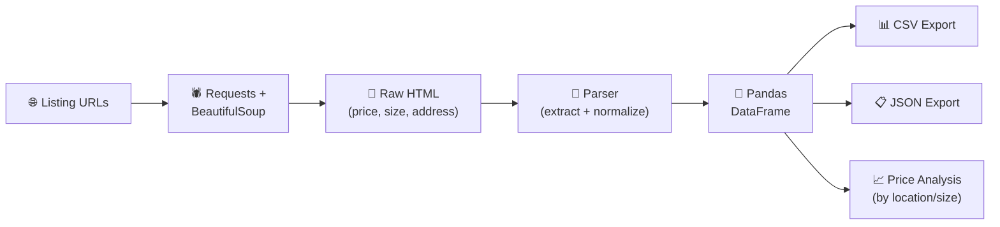

# Apartment Data Parser

<p align="center">
  
  
  
  
  
</p>

A **web scraper and data parser for apartment listings**. Extracts price, size, location, and amenity data from listing pages, normalizes it, and exports to CSV/JSON for analysis.

---

## 🏗️ Pipeline



---

## 🚀 Quick Start

```bash
pip install -r requirements.txt
python scraper.py --url "https://..." --pages 5 --output ./data
```

---

## ⚙️ Output Schema

```json
{
  "title": "2BR Modern Apartment",
  "price": 1850,
  "currency": "USD",
  "size_sqft": 750,
  "bedrooms": 2,
  "bathrooms": 1,
  "address": "Brooklyn, NY",
  "amenities": ["gym", "laundry", "pets_ok"],
  "url": "https://...",
  "scraped_at": "2024-01-15T10:30:00Z"
}
```

---

## 📊 Analysis Features

- Price per square foot by neighborhood
- Price distribution histograms
- Amenity frequency analysis
- Correlation: size vs price

---

## 📄 License

MIT
